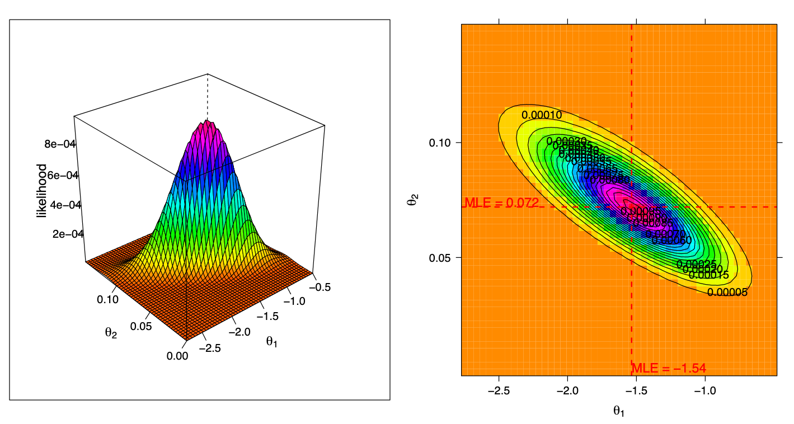
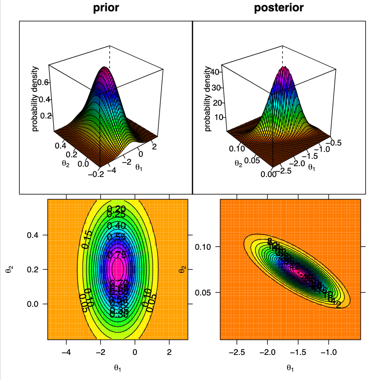
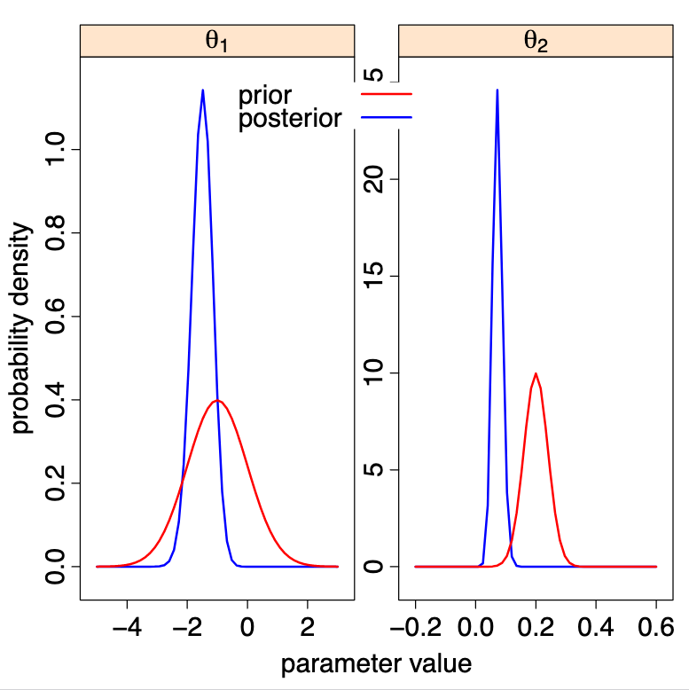

```{r,echo=FALSE,message=FALSE}
knitr::opts_chunk$set(comment='.',fig.align=TRUE,message=FALSE,warning=FALSE)
library(tidyverse)
library(stringr)
library(haven)
library(survival)
library(GGally)
library(binom)
library(texreg)
set.seed(314159)

theme_set(theme_bw())

expit <- function(x) 1 / (1+exp(-x))
``` 

# Outline

* Encountering binary data
* Groundwork
   * Notational conventions
   * Modeling from a probabalistic viewpoint
   
* Bernoulli distribution
   * Defining models
   * Maximum likelihood

* Visualizing relationships
* Models, model checking, and measures of effect
  
# Key learning objectives

* One
* Two
* Three

# What do we mean by binary data?

* Outcomes that have two possible values

* Can be categorical by nature or created by discretizing a categorical or continuous variable

* Examples
   * Objective response / non-response per RECIST
   * Incident adverse event (yes / no)
   * Alive without disease progression vs. progressive disease or died
   * Coin flip (heads / tails)

# What makes binary data interesting?

> -  If you are coming from a Pop PK background, moving away from models with Normal (or log-Normal) residuals may force you to think at a new level of abstraction. 

> -  The Bernoulli distribution for binary data is (in most respects) as simple a statistical distribution as there is. Good place to start for many basic statistical concepts.  

> - There are fewer choices to make and fewer assumptions to check when dealing with binary data (e.g. as compared to time-to-event data). 


# Basic Notation

For now, we will use this high-level notation: 

* Greek letters are <red>model parameters</red>
     * $\mu$  model parameter ("intercept")
     * $\beta$ model parameter (coefficient for effect of exposure or covariate)

* Upper case Roman letters are <red>variables</red>
     * $C$, $D$, $T$ : exposure (think of a steady-state exposure metric for now, e.g. $\mathrm{CAVG}_\mathrm{ss}$), or dose, or just treatment indicator. 
     * $X$ : covariates
     * $Y$ : As-yet-unrealized / unobserved response ("DV")

* Lower case Roman letters are <red>observed values</red>
   * $y$ : Observed value for $Y$ 


# Probability versus statistics

In some cases (e.g., when setting up a model) we will be thinking  in the  data generating / probability direction: 

$$
\begin{eqnarray*} 
\mu,\, \beta,\, C,\, X & \stackrel{\mathrm{Probability}}{\longrightarrow} & Y 
\end{eqnarray*}
$$

In other cases we will be thinking in the model estimating / statistics direction:

$$
\begin{eqnarray*} 
\mu,\, \beta & \stackrel{\mathrm{Statistics}}{\longleftarrow} &  C,\, X,\, y 
\end{eqnarray*}
$$

<!-- # Modeling from a probabilistic point of view -->

<!-- * Those of you who were initially trained in a physical or biological science may have started with a deterministic view of modeling. -->

<!--   * Variability and uncertainty and the statistical tools to -->
<!--       deal with them were obligatory nuisances to deal with "noise" -->
<!--       but not the focus of the modeling. -->

<!--   *  This began to turn around for many of us with the increasing -->
<!--       use of mixed effects modeling in which probability distributions -->
<!--       are used to describe the "unexplained" portion of -->
<!--       inter-individual variability. -->

<!--   * Even then you may have continued to view residual -->
<!--       variability as more of a nuisance than as an integral component -->
<!--       of the model. -->

<!-- * What we will see in this course is that such notions of modeling do not -->
<!--     translate well to modeling of categorical, count or time-to-event -->
<!--     data. A probabilistic perspective is far more useful. -->


# Probability models: continuous variable

Throughout the course we will conceptualize models from a probabalistic or `data generating` viewpoint.

We'll use expressions like:

$$\text{Height} \sim \text{Normal}(\mu, \sigma)$$


**Read as:** 

> Height follows a normal distribution with mean $\mu$ and standard deviation $\sigma$

If we know $\mu$ and $\sigma$ we can 

  * Make probabalistic statements about height in the population
  * Simulate heights
  
# Probability models: binary variable

Suppose we define a binary variable as

$$
Tall = \left\{ \begin{array}{ll}
               1 & Height > 200 cm \\
               0 & Height \leq 200 cm
               \end{array}
       \right.
$$


> NB: Binary random variables are usually defined in this 0/1 manner.

Then our model might be

$$\text{Tall} \sim \text{Bernoulli}(\pi)$$

**Read as:**

> Being tall follows a Bernoulli distribution with the probability of being tall equal to $\pi$

If we know $\pi$

  * Make probabalistic statements about the number of tall people in a random sample from the population
  * Simulate data

# Probability density (mass) function

Both of these link to specific probability density or probability mass functions:

The _normal_ (or _Gaussian_) pdf for height
$$
    p(height \,|\, \mu, \sigma ) = \frac{1}{\sqrt{2\pi}
      \sigma} e^{-\frac{1}{2\sigma^2} \left(height - \mu \right)^2}
$$

and the _Bernoulli_ pmf for Tall

$$
    p( tall \,|\, \pi ) = \pi^\text{tall} (1-\pi)^{1-\text{tall}}
$$
  

<!-- # Modeling from a probabilistic point of view -->

<!-- Start with the notion that the value of a potential future -->
<!--   measurement $Y$ is a random variable -->

<!-- * It is not predictable with certainty (even if we know all of -->
<!--     the model parameters with certainty) -->

<!-- * The probabilities of different values are described in terms -->
<!--     of a probability distribution -->
<!-- $$ Y \sim p\left(y \,|\,\theta, x\right) $$ -->
<!-- where $\theta$ is a vector of model parameters and $x$ is a vector of -->
<!-- covariates. -->

<!-- * If $Y$ is a continuous random variable then $p\left(y \,|\,\theta,x\right)$ is a `probability density function.` -->

<!-- * If $Y$ is a discrete random variable then $p\left(y \,|\, \theta,x\right)$ is a `probability mass function.` -->


<!-- # Example using a pharmacokinetic model -->

<!--   Suppose that $Y$ is a future plasma drug concentration at -->
<!--   some time $t$ following an IV bolus of a drug where the -->
<!--   pharmacokinetics can be described by a 1 compartment model with -->
<!--   normally distributed residual variation. -->

<!--   \begin{eqnarray*} -->
<!--     Y &\sim& N\left(y \,|\, \widehat{c}\left(t, D, CL, -->
<!--       V\right), \sigma \right) \\ -->
<!--     p\left(y \,|\, \widehat{c}\left(t, D, CL, -->
<!--       V\right), \sigma \right) &=& \frac{1}{\sqrt{2\pi} -->
<!--       \sigma} e^{-\frac{1}{2\sigma^2} \left(y - \widehat{c}\left(t, D, CL, -->
<!--           V\right)\right)^2} \\ -->
<!--     \widehat{c}\left(t, D, CL, -->
<!--       V\right) &=& \frac{D}{V} e^{-\frac{CL}{V} t} -->
<!--   \end{eqnarray*} -->

<!--   Even if you know the values of $CL$, $V$ and $\sigma$ you -->
<!--   cannot say that $Y$ will be a particular value. However, you can say -->
<!--   the probability that $Y$ will be within some specified interval. -->


# The likelihood function

   
* Suppose you observed a measured value $Y = y_{obs}$.

    <!-- * That value is no longer a random variable since we know its -->
    <!-- value. -->

* If we view the <grn>pdf</grn> or <grn>pmf</grn> as a function of the parameters, conditional on some observed data $y_{obs}$, we refer to the function as a <red>likelihood function</red>
<!-- * If we insert that observed value into our probability -->
<!--     distribution function we now refer to that function as a -->
<!--     ***likelihood function***. -->

* It is the ***same function as before*** but we now view it as a
    function of the parameters given the data instead of as a function
    of the data given the parameters.
 
<p align="center">
<red>$L\left(\theta \,|\,y_{obs}, x\right)$</red> $=$ <grn>$p\left(y_{obs} \,|\,\theta,
  x\right)$</grn>
</p>

# Modeling from a probabilistic point of view: The likelihood function

$$ L\left(\theta \,|\,y_{obs}, x\right) = p\left(y_{obs} \,|\, \theta,
  x\right) $$
 
* During model development we generally do not know the values of
  the parameters $\theta$ and use the observed data to estimate those
  parameters.

* The likelihood function contains information about what those
  parameter values might be.

* We will talk about two different approaches that exploit the
  likelihood function to estimate $\theta$:
   
  * Maximum likelihood estimation
  * Bayesian statistical analysis
   
 


# The Bernoulli likelihood for one observation

<red>Likelihood</red> for a single Bernoulli observation

$$
l(p \, | \, Y_i = y_i) = P(Y_i=y_i) = \left\{ \begin{array}{ll}p & y_i = 1 \\ 1-p & y_i = 0 \end{array} \right.
$$
We often see this written more compactly as

$$
l(p \, | \, Y_i = y_i) = p^{y_i}(1-p)^{(1-y_i)} 
$$
<br>

# The Bernoulli joint likelihood function

<red>Joint likelihood</red> for a sample of independent Bernoulli observations

$$
\begin{eqnarray*}
l(p | \mathbf{Y}=\mathbf{y}) & = & \prod_{i=1}^{n} P(Y_i=y_i) \\
  & = &   \prod_{i=1}^{n}p^{y_i}(1-p)^{(1-y_i)} \\
& = & p^{(\# \, \text{of "ones"})}(1-p)^{n - (\# \, \text{of "ones"})}
\end{eqnarray*}
$$


<red>Joint log likelihood:</red>

$$
\begin{eqnarray*}
L(p \,\, | \,\, \mathbf{Y}=\mathbf{y}) & = & l(p | \mathbf{Y}=\mathbf{y}) \\
 & = & (\# \, \text{of "ones"}) \log(p)
 + (n-\# \, \text{of "ones"}) \log(1-p) 
\end{eqnarray*}
$$

# Maximum likelihood estimation


<red>Maximum likelihood estimates</red> are the values of the parameters ($p$) which maximize the likelihood.

> Derivative of joint log likelihood: 

$$
\begin{align*}
\frac{\mathrm{d}L}{\mathrm{d}p} &= \frac{(\# \, \text{of successes})}{p} - \frac{(n- \# \, \text{of successes})}{1-p}
\end{align*}
$$


$$
\frac{\mathrm{d}L}{\mathrm{d}p} = 0 \iff  p = \frac{(\# \, \text{of successes})}{n}
$$

* Estimator for $\hat p$ is as expected from probability perspective
* Note: common value of $p$ for all subjects


# Log likelihood

* When we have a full logistic regression model with covariates, there is no analytical solution to the likelihood equations. 
* However there is a numerical root finder that is specially tailored to the structure of logistic (and all GLM) models: the `Newton-Raphson` method ([see @2795]).


<!-- # Maximum likelihood for continuous data -->

<!-- * Apply this idea to our one compartment model example. -->

<!-- * Suppose we observed a plasma drug concentration on two occasions. -->

<!-- * The resulting likelihood function is: -->

<!--   \begin{eqnarray*} -->
<!--     L\left(CL, V, \sigma^2 \,|\, y_{obs1}, y_{obs2}, t_1, t_2, D\right) -->
<!--     &=& \prod_{i=1}^2  L\left(CL, V, \sigma^2 \,|\, y_{obsi}, -->
<!--       t_i, D\right) \\ -->
<!--     &=& \prod_{i=1}^2 \frac{1}{\sqrt{2\pi} -->
<!--       \sigma} e^{-\frac{1}{2\sigma^2} \left(y_{obsi} - \widehat{c}\left(t_i, D, CL, -->
<!--           V\right)\right)^2} \\ -->
<!--     \widehat{c}\left(t, D, CL, -->
<!--       V\right) &=& \frac{D}{V} e^{-\frac{CL}{V} t} -->
<!--   \end{eqnarray*} -->


<!-- # Maximum likelihood for continuous data -->


<!-- *  The above equation generalizes to any number of observations. -->

<!-- *  For $n$ observations described by a normal distribution where -->
<!--     the mean is a function $f\left(x,\theta\right)$ of the parameters -->
<!--     $\theta$ and covariates $x$: -->
<!--     \begin{eqnarray*} -->
<!--       L\left(\theta \,|\, y_{obs}, x\right) -->
<!--       &=& \prod_{i=1}^n  L\left(\theta \,|\, y_{obsi}, x_i\right) \\ -->
<!--       &=& \prod_{i=1}^n \frac{1}{\sqrt{2\pi} -->
<!--         \sigma} e^{-\frac{1}{2\sigma^2} \left(y_{obsi} - f\left(x_i, \theta\right)\right)^2} \\ -->
<!--     \end{eqnarray*} -->

<!-- *  The maximum likelihood estimate of $\theta$ is the value of -->
<!--     $\theta$ that maximizes this likelihood function. -->


<!-- # Maximum likelihood for continuous data -->


<!-- *  Rather than maximize the likelihood directly, many ML -->
<!--     algorithms minimize the transformation $-2log\left(L\left(\theta -->
<!--         \,|\,y_{obs},x\right)\right)$ -->

<!-- *  For the above normally-distributed case this becomes: -->
<!-- <font size="5">   -->
<!-- \begin{eqnarray*} -->
<!--       -2\log\left(L\left(\theta \,|\, y_{obs}, x\right)\right) -->
<!--       &=& \sum_{i=1}^n  -2\log\left(L\left(\theta \,|\, y_{obsi}, x_i\right)\right) \\ -->
<!--       &=& \sum_{i=1}^n -2\log\left(\frac{1}{\sqrt{2\pi} -->
<!--           \sigma} e^{-\frac{1}{2\sigma^2} \left(y_{obsi} - f\left(x_i, -->
<!--               \theta\right)\right)^2}\right) \\ -->
<!--       &=& \sum_{i=1}^n \left(\log\left(2\pi\right) + -->
<!--         \log\left(\sigma^2\right) + \frac{\left(y_{obsi} - f\left(x_i, -->
<!--               \theta\right)\right)^2}{\sigma^2}\right) \\ -->
<!--       &=& n\log\left(2\pi\right) + -->
<!--       n\log\left(\sigma^2\right) + \sum_{i=1}^n \frac{\left(y_{obsi} - f\left(x_i, -->
<!--             \theta\right)\right)^2}{\sigma^2}  -->
<!-- \end{eqnarray*} -->
<!-- </font> -->

<!-- *  This shows that the least-squares estimates of $\theta$ are -->
<!--     also the ML estimates for this case. -->


<!-- # Extending ML to "odd-type" data -->

<!-- Binary data -->

<!-- *  Most often binary data is used to represent the occurrence or -->
<!--     non-occurrence of an event. -->

<!-- *  We often use numerical values such as 1 and 0 to represent -->
<!--     those two possible outcomes, e.g., 1 for "it happened" and 0 for -->
<!--     "it didn't happen". -->

<!-- *  Suppose we want to model the occurrence of a particular -->
<!--     adverse event. Let's start with one patient. The random variable -->
<!--     $Y$ representing the possible AE occurrence is 1 if the AE occurs -->
<!--     and 0 if it doesn't. This is just a Bernoulli trial that is -->
<!--     modeled as: -->
<!--     \begin{eqnarray*} -->
<!--       Y \sim p\left(y \,|\,\theta, x\right) &=& \left\{\begin{array}{ll} -->
<!--           p_{AE}\left(\theta, x\right), & y = 1 \\ -->
<!--           1 - p_{AE}\left(\theta, x\right), & y = 0  -->
<!--         \end{array}\right. \\ -->
<!--       &=& p_{AE}\left(\theta, x\right)^y \left(1 - p_{AE}\left(\theta, -->
<!--           x\right)\right)^{1 - y} -->
<!--     \end{eqnarray*} -->
<!--     where $p_{AE}\left(\theta, x\right)$ is the probability that the -->
<!--     AE occurs shown as a function of one or more parameters $\theta$ -->
<!--     and covariates $x$. -->
   

# Binary Data Example


* This data set is comprised of a two-week study (protocol A) and a six-week study (protocol B)

* The data set includes patients of type `PT2`, a patient type that (let's say) has not been studied at higher dose levels.

* Suppose further that a dose level under consideration for a phase 2 study in `PT2` would have typical value exposures near 2.5 ug/mL.

* The objective of *this* anlaysis is to determine whether the AE rate will be "sufficiently low" in `PT2` at that exposure.

# Data snapshot

\small 

```{r, echo=FALSE}
load('../data/aedat.RDS')
aedat %>% 
  mutate(across(where(is.numeric), pmtables::sig)) %>% 
  select(STUDYID, USUBJID, PBO, CAVGSS, AE01, AETOXGR) %>% 
  head(n=5)
```

* `STUDYID`: protocol
* `USUBJID`: unique subject id
* `AE01`: adverse event of grade 3 or higher

# Workbook

* Biomial density
* Likelihood function

# Visualizing relationships

Objective:

> Plot the probability of a 'success' vs predictor(s0) 

Types of plots will depend on the predictor variable:

* Categorical variable
* Continuous variable

# Relationship with categorical variable

* x-axis: Categorical variable (`STUDYID`)
* y-axis: Probability of Grade 3+ AE (`AE01`)
* geom: `bar`, `point`

# Example plots: categorical

What else might be nice to add to this plot?

```{r}
aedat %>% group_by(STUDYID) %>% 
  summarise(phat = sum(AE01) / n()) %>% 
  ggplot(aes(x=STUDYID, y=phat)) + 
  geom_col()
```

# Example plots: categorical with confidence interval {.sourceCode.r.small}
::: columns

:::: column
```{r}
p <- aedat %>% 
  group_by(STUDYID) %>% 
  summarise(x = sum(AE01), n=n()) %>% 
  mutate(phat = x / n,
         lcl = binom.confint(x,n,methods = "wilson")$lower,
         ucl = binom.confint(x,n,methods = "wilson")$upper) %>% 
  ggplot(aes(x=STUDYID, y=phat)) + 
  geom_col() +
  geom_errorbar(aes(ymin=lcl, ymax=ucl), 
                width = 0.2)
```

Note: `binom.confint` is in the `binom` package
::::

:::: column
```{r, echo=FALSE, out.width="95%"}
p
```
::::

:::


<!-- <div class='right' style='float:right;width:48%'> -->
<!-- ```{r, echo=FALSE, out.width="95%"} -->
<!-- p + geom_point() -->
<!-- ``` -->
<!-- </div> -->


# Relationship with a continuous variable

```{r, echo=FALSE}
dat_use <-
  aedat %>% 
  group_by(PBO) %>%
  mutate(Quartile = ifelse(PBO == "PBO", "PBO",
                           paste0("Q", ntile(CAVGSS, n = 4))))
```

```{r, echo=FALSE}
dat_eda <- dat_use %>% group_by(Quartile) %>% mutate(MedConc = median(CAVGSS))
p <- ggplot() +
  geom_rug(data = filter(dat_eda, AE01 == 0),
           aes(x = CAVGSS), sides = "b") +
  geom_rug(data = filter(dat_eda, AE01 == 1),
           aes(x = CAVGSS), sides = "t") +
  # NB: default smoother is problematic for 0-1
  # data. More on this later but live with it
  # for now.
  geom_smooth(data = dat_eda,
              aes(x = CAVGSS, y = AE01),
              method='gam', formula=y~s(x),
              method.args = list(family='binomial')) +
  stat_summary(
    data = dat_eda,
    aes(x = MedConc, y = AE01, group = MedConc),
    fun = function(y) sum(y) / length(y),
    geom = "point"
  ) +
  stat_summary(
    data = dat_eda,
    aes(x = MedConc, y = AE01),   
    # Wilson CI recommended by Agresti and Coull (2000) review paper
    fun.min = function(y) {
      binom.confint(sum(y),length(y),
                    methods = "wilson")$lower
      },
    fun.max = function(y) {
      binom.confint(sum(y), length(y),
                    methods = "wilson")$upper
      },
    geom = "errorbar"
  )
p
```


# Plotting tips

* Break exposure into quartiles, compare incidence rate across quartiles
  * Textbook variance formula $\frac{p(1-p)}{n}$ isn't the best choice with small sample sizes and probabilities near zero or one
  * Recommendation: Use Wilson interval (implemented in  `binom.confint`)
* Rug plots (`geom_rug`)
* Stratify by other covariates of interest


<!-- # ML modeling of binary data -->

<!-- Let's try modeling the probability of an AE in the $i^{th}$ patient -->
<!--   as a function of $C_{avg,ss}$ according to a linear logistic model: -->
<!-- $$ \text{logit}\left(p_{AE}\left(\theta, C_{avg,ss} \right)\right) = \theta_0 -->
<!-- + \theta_1 C_{avg,ss} $$  -->
<!-- The logit transformation is commonly used to -->
<!-- transform between the range of probability (0,1) and the entire real -->
<!-- line: -->
<!-- \begin{eqnarray*} -->
<!--   \text{logit}\left(p\right) &=& \log\left(\frac{p}{1 - p}\right), \ \ 0 < p -->
<!--   < 1 \\ -->
<!--   \text{logit}^{-1}\left(x\right) &=& \frac{e^x}{1 + e^x} = -->
<!--   \frac{1}{e^{-x} + 1}, \ \ -\infty < x < \infty -->
<!-- \end{eqnarray*} -->
<!-- The inverse logit is also sometimes referred to as the expit -->
<!--   function. -->

<!-- # ML modeling of binary data -->

<!--   So the likelihood for that patient is: -->
<!-- $$ L\left(\theta \,|\,y_{obsi}, D_i\right) = p\left(y_{obsi} \,|\,\theta, -->
<!--   D_i\right) = p_{AE}\left(\theta, D_i\right)^{y_{obsi}} \left(1 - -->
<!--   p_{AE}\left(\theta, D_i\right)\right)^{1 - y_{obsi}} $$  -->
<!-- The overall -->
<!-- likelihood for the study results is: -->
<!-- \begin{eqnarray*} L\left(\theta \,|\,y_{obs}, D\right) &=& -->
<!--   \prod_{i=1}^{100} p\left(y_{obsi} \,|\,\theta, D_i\right) \\ -->
<!--   &=& \prod_{i=1}^{100} p_{AE}\left(\theta, D_i\right)^{y_{obsi}} -->
<!--   \left(1 - p_{AE}\left(\theta, D_i\right)\right)^{1 - y_{obsi}}  -->
<!-- \end{eqnarray*} -->
<!-- where yobs -->
<!-- and D are vectors of the individual patient values. \newline -->

<!-- The value of $\theta$ that maximizes the likelihood value is the ML -->
<!-- estimate. -->


<!-- # Likelihood function for binary data example -->

<!-- <p align="center"> -->
<!--    -->
<!-- </p> -->


<!-- # A brief review of Bayesian inference -->
<!-- ### Bayes Rule -->


<!-- $\color{firebrick}{\text{Bayes Rule}}$ the basis for inference about model parameters ($\theta$) given data ($y$) and prior knowledge about model parameters ($p\left(\theta\right)$): -->
<!-- \begin{eqnarray*} -->
<!-- p\left(\theta\,|\,y\right) &=& \frac{p\left(\theta\right)p\left(y\,|\,\theta\right)}{p\left(y\right)} -->
<!-- = \frac{p\left(\theta\right)p\left(y\,|\,\,\theta\right)}{\int{p\left(\theta\right)p\left(y\,|\,\theta\right) d\theta}} -->
<!-- \\  -->
<!-- &\propto& p\left(\theta\right)p\left(y\,|\,\theta\right) -->
<!-- \end{eqnarray*} -->
<!-- The $p$'s are probabilities or probability densities of the specified random variables. -->

<!-- # Bayesian modeling/inference process -->

<!-- <font size="6">   -->

<!-- 1. Assess prior distribution $p\left(\theta\right)$ -->

<!--     * $\theta$ viewed as random variables -->

<!--     * Subjective -->

<!--     * Ideally base on all available evidence/knowledge (or belief) -->

<!--     * Or deliberately select a non-informative (or weakly informative) -->
<!--   prior (e.g., reference, vague or improper prior) -->

<!-- 2. Construct a model for the data $p\left(y \,|\, \theta\right)$, also known as the likelihood function when viewed as a function of $\theta$. -->

<!-- 3.  Calculate posterior distribution $p\left(\theta \,|\, y\right)$. -->

<!--     * Use for inferences regarding parameter values -->

<!-- 4. Calculate posterior predictive distribution $p\left(y_\text{new} \,|\, y\right)$. -->

<!--     * Use for inferences regarding future observations -->

<!-- $$p\left(y_{new}\,|\,y\right) = \int{p\left(y_{new}\,|\,\theta\right)p\left(\theta\,|\,y\right) d\theta}$$ -->
<!-- </font> -->


<!-- # Bayesian modeling of odd-type data -->

<!-- *  Return to the linear logistic regression example where we observe whether or not an AE -->
<!--     occurs in each of 100 patients and the probability of an AE is -->
<!--     given by -->

<!-- $$ \text{logit}\left(p_{AE}\left(\theta, D_I\right)\right) = \theta_1 + \theta_2 D_i $$  -->

<!-- *  The likelihood function is the same as before. -->

<!-- *  Now we must also specify a prior distribution for the model -->
<!--     parameters $\theta$. The resulting expression for the posterior -->
<!--     distribution of $\theta$ is: -->

<!--   \begin{eqnarray*} -->
<!--     p\left(\theta \,|\, y_{obs}, D\right) &\propto& p\left(y_{obs} \,|\, \theta, -->
<!--       D\right) p\left(\theta\right) = L\left(\theta \,|\, y_{obs}, D\right) -->
<!--     p\left(\theta\right) \\ -->
<!--     &\propto& -->
<!--     \prod_{i=1}^{100} p\left(y_{obsi} \,|\, \theta, D_i\right) -->
<!--     p\left(\theta\right) \\ -->
<!--     &\propto& \prod_{i=1}^{100} p_{AE}\left(\theta, D_i\right)^{y_{obsi}} -->
<!--     \left(1 - p_{AE}\left(\theta, D_i\right)\right)^{1 - y_{obsi}} p\left(\theta\right) -->
<!--   \end{eqnarray*} -->

<!-- # Bayesian modeling of odd-type data -->

<!-- Now suppose we have a little prior information about the value of $\theta$ -->
<!-- and choose to represent that knowledge as a bivariate normal -->
<!-- distribution with relatively large variances and no correlation, i.e.,  -->
<!-- $$ \theta \propto N\left(\mu, \Sigma\right) $$ -->
<!-- where  -->
<!-- $$ \mu = \left(-1, 0.2\right) \ \ \ \ \Sigma = \left[\begin{array}{cc} -->
<!-- 1^2 & 0 \\ -->
<!-- 0 & 0.2^2 -->
<!-- \end{array}\right] $$ -->

<!-- # Joint prior and posterior distributions -->

<!-- \vspace{-9pt} -->
<!-- \begin{center} -->
<!-- \includegraphics[height=0.95\textheight]{graphics/binaryExampleJointPosterior.pdf} -->
<!-- \end{center} -->

<!-- <p align="center"> -->
<!--    -->
<!-- </p> -->

<!-- # Marginal prior and posterior distributions -->

<!-- \vspace{-9pt} -->
<!-- \begin{center} -->
<!-- \includegraphics[height=0.95\textheight]{graphics/binaryExampleMarginalPosterior.pdf} -->
<!-- \end{center} -->

<!-- <p align="center"> -->
<!--    -->
<!-- </p> -->

<!-- # Modeling binary data: Logistic regression -->

<!--   Logistic regression refers to the fitting of binary data with models -->
<!--   of the form: -->
<!-- $$ \text{logit}\left(p\right) = f\left(x, \theta\right) $$ -->
<!-- where $p$ is the probability that some event (e.g., an AE) occurs and -->
<!-- $x$ is a vector of covariates. -->


<!-- # Stats notation for the Bernoulli distribution -->


<!-- $$ -->
<!-- Y_i \sim \mathrm{Ber}(p) \,\,\, \mathrm{independently} \text{ for} \,\, i = 1, \ldots, n -->
<!-- $$ -->
<!-- Or equivalently, we could specify the probability mass function: -->

<!-- $$ -->
<!-- \begin{eqnarray*} -->
<!-- P(Y_i=y_i \, | \, p) = p^{y_i}(1-p)^{(1-y_i)} \,\, \text{for} \,\, i = 1, \ldots, n  \\ (\text{where each} \,\, y_i = 0 \,\, \text{or} \,\, 1). -->
<!-- \end{eqnarray*} -->
<!-- $$ -->

<!-- # Workbook  -->

<!-- * rbinom -->
<!-- * dbinom -->

<!-- # The Likelihood function -->

<!-- __Likelihood__ for a single Bernoulli observation -->

<!-- $$ -->
<!-- l(p \, | \, Y_i = y_i) = P(Y_i=y_i) = p^{y_i}(1-p)^{(1-y_i)}  -->
<!-- $$ -->

<!-- __Joint likelihood__ for a sample for independent Bernoulli observations -->

<!-- $$ -->
<!-- \begin{eqnarray*} -->
<!-- l(p \,|\, \mathbf{Y}=\mathbf{y}) & = & \prod_{i=1}^{n} P(Y_i=y_i)  =   \prod_{i=1}^{n}p^{y_i}(1-p)^{(1-y_i)} \\ -->
<!-- & = & p^{(\# \, \text{of "ones"})}(1-p)^{n - (\# \, \text{of "ones"})} -->
<!-- \end{eqnarray*} -->
<!-- $$ -->

<!-- # Log likelihood -->

<!-- Joint __log__ likelihood: -->

<!-- $$ -->
<!-- \begin{eqnarray*} -->
<!-- L(p \,|\, \mathbf{Y}=\mathbf{y}) & = & (\# \, \text{of successes}) \log(p)  \\  -->
<!-- & + & (n-\# \, \text{of successes}) \log(1-p)  -->
<!-- \end{eqnarray*} -->
<!-- $$ -->

<!-- Derivative of joint log likelihood:  -->

<!-- $$ -->
<!-- \frac{\mathrm{d}L}{\mathrm{d}p} = 0 \iff  p = \frac{(\# \, \text{of successes})}{n} -->
<!-- $$ -->

<!-- * When we have a full GLM with covariates, there is no analytical solution to the likelihood equations.  -->
<!-- * However there is a numerical root finder that is specially tailored to the structure of GLM models: the `Newton-Raphson` method ([see @2795]).  -->

<!-- # Likelihood maximization -->

<!-- * As in the workbook exercises, an generic numerical optimization algorithm (e.g. `optim()`) *can* be used to maximize the likelihood for a full GLM.   -->
<!-- * In fact, in (rare) special cases, it makes sense to do exactly that. (E.g. if there are constraints on some parameters: [see @3625], p. 269]).  -->
<!-- * Again, more typically, Newton-Raphson is used.  -->

<!-- # Workbook  -->

<!-- * likelihood computation  -->
<!-- * likelihood maximization -->

# Measures of effect: odds ratio

* `Conditional probability` of an event, conditional on treatment "1".

$$ P(Y=1 \, | \, T = 1) $$

* `Odds` of an event, conditional on treatment "1": 

$$ \frac{P(Y=1 \, | \, T = 1)}{P(Y=0 \, | \, T = 1)} = \frac{P(Y=1 \, | \, T = 1)}{1 - P(Y=1 \, | \, T = 1)}$$

* `Odds ratio` of an event, for treatment "1" versus treatment "0":

$$ \frac{\left.P(Y=1 \, | \, T = 1)\, \right/ P(Y=0 \, | \, T = 1)}{\left.P(Y=1 \, | \, T = 0) \, \right/ P(Y=0 \, | \, T = 0) }$$


# Measures of effect: relative risk

Relative risk of an event, for treatment "1" versus treatment "0":

$$ \frac{P(Y=1 \, | \, T = 1)}{P(Y=1 \, | \, T = 0)}$$
Anecdotally, this is often the preferred / most interpretable way to quantify efficacy.

NB: Odds ratio and relative risk are sometimes confused with each other. Note the difference. 


# Other measures of effect for binary data
    
Difference in probability of events, for treatment "1" versus treatment "0":
    

$$ P(Y=1 \, | \, T = 1) - P(Y=1 \, | \, T = 0) $$
Often undesirable: do you want to treat the difference between 3% and 5% the same way that you treat the difference between 23% and 25% ? 

# Workbook

* odds ratios


# The logit transform

* The logit, or "log odds" function

$$\mathrm{logit}(p)=\log\left(\frac{p}{1-p}\right)$$

* The standard logistic function (also called the "expit") is the inverse of the logit:

$$p = \mathrm{expit}(x)=1/(1+\exp(-x))$$ 

# Workbook

* logistic function

# Other "link functions"

* logit function takes us from the unit interval to the full Real line: 

$$ (0, 1) \stackrel{\mathrm{expit}}{\longrightarrow} \mathbb{R} $$

* Another alternative "link" function is the `probit` : 

$$ \mathrm{probit}(p) = \Phi^{-1}(p)$$ 
Where $\Phi$ is the Normal Cumulative Density Function (CDF): 

$$ \Phi(x) = P(\mbox{Std. Normal Variate} < x)  $$

# More About Link Functions

* Complementary log-log link ( $\log( - \log(1 - p)$) is much less common
  * Its an asymmetrical link function
  * Shows up when transforming other models to binary outcomes, e.g. Poisson model to binary model
  

```{r, echo=FALSE, message=FALSE, width=4*1.6, height=4}

data.frame(x = c(-5, 5)) %>%
  ggplot(aes(x = x), ) +
  stat_function(fun = ~1-exp(-exp(.x)), aes(colour = "Complementary log-log"), size = 2, alpha = 0.6, show.legend = TRUE) +
  stat_function(fun = pnorm, aes(colour = "Probit"), size = 2, alpha = 0.6, show.legend = TRUE) +
  stat_function(fun = expit, aes(colour = "Logit"), size = 2, alpha = 0.5, show.legend = TRUE) +
  scale_colour_manual(name = "Link Function", values = c("Logit" = "black", "Probit" = "orange", "Complementary log-log" = "blue")) +
  labs(x = "Linear Predictor", y = "Probability")
  

```


# A logit-link GLM

A GLM with a logit link and Bernoulli (or more generally, Binomial) distribution is referred to as a <red>logistic regression</red>. 

A logistic regression with exposure ($C_i$) as the sole predictor would be expressed as: 

$$ Y_i \sim \mathrm{Ber}(p_i) \,\,\, \text{where} \,\,\, p_i = \mathrm{expit}(\mu + \beta C_i) \,\, ; \,\,i = 1,\ldots, n$$

Or equivalently:

$$ Y_i \sim \mathrm{Ber}(p_i) \,\,\, \text{where} \,\,\, \mathrm{logit}(p_i) = \mu + \beta C_i \,\, ; \,\,i = 1,\ldots, n$$


# Logistic regression is a type of GLM

* The `generalized` in `generalized linear model` refers to the non-Normal residuals (in this case, Bernoulli residuals). 

* The `linear` in `generalized linear model` refers to the fact that the right hand side of, e.g. 
    
$$ \mathrm{logit}(p_i) = \mu + \beta C_i $$
is linear <red>in the parameters</red> (i.e. it is a linear function of $\mu$ and $\beta$).


# Quiz 

Which (if any) of the following is linear in the parameters?

$$\mu + \beta \log(C)  \,\,\,\,\,\,\,\,\,\,\, \mu + \frac{\beta}{C} \,\,\,\,\,\,\,\,\,\,\, \mu + \frac{\beta_1 C}{(\beta_2 + C)}$$


# Anatomy of a GLM

Taking the following model as an example: 

$$ Y_i \sim \mathrm{Ber}(p_i) \,\,\, \text{where} \,\,\, \mathrm{logit}(p_i) = \mu + \beta C^*_i \,\, ; \,\,i = 1,\ldots, n$$

Standard terminology to refer to the model components is:

* <grn>$Y_i \sim \mathrm{Ber}(p_i)$</grn> is the <red>distribution</red> component of the model. (Sometimes also called the `random` component of the model, but we avoid that terminology is it becomes ambiguous in a `GLMM` context that includes random effects).
* The <grnlogit</grn> transformation is the <red>link</red> function. 
* <grn>$\mu + \beta C^*_i$</grn> is the <red>linear predictor</red>.


# Key Assumptions for Logistic Regression 

* Residual distribution assumptions: 
    * Observations are independent (conditional on covariates and exposure).
    * Observations associated with identical covariate values are identically distributed. 
    * For Bernoulli residuals, the only remaining distributional "assumption" is that the data are binary (pretty easy to check!). 
* Linear predictor:
    * All relevant predictors are in the model and suitably transformed. 
    * Interaction terms included where necessary. 
    * "Plays nicely" with link function. 
* Missing data assumptions. 


# General R model syntax

The right-hand side of the formula syntax: 

```{r, eval=FALSE}
~ CAVGSS + BWT + PTTYPE + SEXTXT
```

specifies that the linear predictor is 

$$ 
\begin{eqnarray*}
\beta_0 & + & \beta_\mathrm{C} \mathrm{C} + \beta_\mathrm{W} \mathrm{W} + \\
&& \beta_\mathrm{PT1} \mathrm{I}_{\mathrm{PT}=\mathrm{PT1}} + 
\beta_\mathrm{PT2} \mathrm{I}_{\mathrm{PT}=\mathrm{PT2}} + 
\beta_\mathrm{M} \mathrm{I}_{\mathrm{SEX}=\mathrm{M}} 
\end{eqnarray*}
$$ 

NB: formula syntax gets interpreted differently in R depending on the type of model being fit. E.g. models are specified differently in `nls`, `nlme`, `gnlm`, to name a few. 

# Factor variables in R models

* Most modeling and plotting functions in R treat factor variables differently from numerical variables. 
* For modeling functions, the first factor level is treated as the "reference level".
* Choice of reference level determines the interpretation of the model intercept. 
* As our field uses *another tool* that doesn't allow character variables, you will probably end up 
with some categorical variables that have numerical values...
    * Remember to "factorize" your categorical variables!
    * `as.factor(SEX)` can even be used directly in model formula!

# Fitting a logistic regression in R

```
mod1 <- glm(AE01 ~ CAVGSS + BWT + PTTYPE + SEXTXT,
            data = aedat,
            family = binomial(link='logit'))
```

* <red>`AE01`</red>: binary outcome variable
* <red>`CAVGSS + BWT + PTTYPE + SEXTXT`</red>: linear predictor
* <red>`family = binomial(link='logit')`</red>: distribution and link function.  
* other link functions include `probit` and `cloglog`  


# Interpreting coefficients in logit-link models

* The logistic or expit $\textit{expit}(x) = \frac{1}{1 + exp(-x)}$ function can be applied to the intercept or linear predictor to transform it to a probability. 
* The covariate coefficients can be exponentiated to correspond to odds ratios. 

# Interpreting covariate effects on the probability scale

* A unit of improvement in $x$ means different things depending upon the reference $x$
* Largest change always occurs at the inflection point
    * The derivative of the logistic function is maximized at $p=0.5$ and is maximized by $\beta/4$

```{r, echo=FALSE, message=FALSE, width=4*1.6, height=4}
data.frame(
  LP = seq(-6,6,.1)
) %>%
  mutate(prob=expit(LP)) %>%
  ggplot(aes(x=LP,y=prob)) + geom_line() + 
  theme_bw() + 
  geom_segment(aes(x=0,y=.5,xend=1,yend=.5),lty=2) +
  geom_segment(aes(x=1,y=.5,xend=1,yend=expit(1)),lty=2) +
  geom_segment(aes(x=3,y=expit(3),xend=4,yend=expit(3)),lty=2) +
  geom_segment(aes(x=4,y=expit(3),xend=4,yend=expit(4)),lty=2) +
  xlab('Linear predictor (i.e., "x")') + ylab("Probability") +
  geom_label(data=NULL, parse=TRUE,
             aes(x=-4, y=.75, 
                 # label=paste("mu==0~beta==1"))
                 label=paste("logit(p)==0 + 1*x")
             )) + 
  geom_label(data=NULL, aes(x=.5,y=.45,label="1 unit")) +
  geom_label(data=NULL, aes(x=3.5,y=.9,label="1 unit")) +
  geom_label(data=NULL, aes(x=1.75,y=.6,label=paste("beta/4")), parse=TRUE)

```

# Interpretation of covariate effects

* Let $p_1$ refer to probability of AE for a `PT1` patient and 
* Let $p_0$ refer to probability of AE for `HV` with exactly the same exposure and covariate values. 
* Then:

$$ 
\mathrm{logit}(p_{1}) - \mathrm{logit}(p_{0}) = \beta_{\mathrm{PT1}}
$$ 
And since the logit function is the log-odds function, that implies: 

$$
\frac{p_{1}/(1-p_{1})}{p_{0}/(1-p_0)} = \exp(\beta_{\mathrm{PT1}})
$$
In other words, $\exp(\beta_{\mathrm{PT1}})$ is the odds ratio for the effect of being type `PT1` versus `HV`. 

# Interpretation of effects for continuous predictors

* For continuous covariates, the odds ratio adjustments are exponential "per unit", e.g. with $\beta_{WT} = log(1.008) = 0.00797$, a 10 kg difference in weight corresponds to an odds increase of $1.008^{10} \sim 1.08$, i.e. an 8\% increase.
* May be advantageous to scale exposure (e.g. divide by 1000) in order to avoid exponentiated coefficients like $1.000123$. (Which might indicate a consequential effect despite being very close to 1: try $1.000123^{1000}$.)


<!-- # Interpretation of covariate effects for probit-link models -->

<!-- * You really can't.  -->
<!-- * That's part of the reason for the popularity of logit-link models.  -->
<!-- * How much does that really matter? -->
<!--     * It's certainly nice to have directly interpretable coefficients.  -->
<!--     * But in many cases, the predictive inferences matter more than the direct inferences on parameters.  -->
<!--     * Recommendation: choose link function based on what fits the data better, not based on mathematical convenience. Probit link handles models where tails are more "certain" -->
<!-- * Probit models also arise from a different modeling framework: a latent variable determined by covariates with random gaussian noise with a threshold for a "true" outcome -->

<!-- End day 1 here with workbook -->

# Choice of exposure metric


# Residual Diagnostics

* Common types of residuals: 
    * "Response" residuals (the usual `DV-PRED`). 
    * Deviance residuals.
    * Pearson residuals.
* For __all__ of these, lower your expectations: 
    * Plots usually look "chunky".
    * Natural consequence of binary data. 
    * Some sort of smoother needed to aid the eye. 
    
# Response residuals

* Easiest residuals to conceptualize. 
* Not expected to be "homoscedastic" or even symmetric around the $y=0$ line. 
* Still expected to be at the $y=0$ line "on average".
* Advantage: departures from $y=0$ are on the probability scale. 
* Don't be fooled: 
    * Consequential departures from the $y=0$ line can be obscured by the plotting scale.
    * Response residuals range from -1 to 1. 
    * Plot appearance can depend on distribution of covariates apart from the model 
    
# Other residuals  (Pearson, Deviance)  

* Pearson residuals are like standardizing residuals in linear models 
* Deviance residuals are the contributions to the log-likelihood of each data point
* Benefits: 
    * More nearly symmetric and homoscedastic (if model is correct).
    * Deviance residuals should be asymptotically normally distributed
* Suggestions: 
    * Start with response residuals. You know what these mean. 
    * Compare with deviance residuals. If the deviance residual plots look better, take comfort. 
    * Don't spend too much time trying to get any residual plots to look "good". They won't. Use them to suggest model refinements and then move on. 
* The total residual deviance should be "close" to the residaul degrees of freedom

# Simulation-based Diagnostics

* Quantile Residuals
    * Use model to simulate data and calculate quantile of observed values against simulated data
    * Smooths out discrete residual values
    * DHARMa Package in R does this nicely
    
* VPCs
  * Problem dependent
  * A place to start is bucketing covariates and assessing overall trends


# Model Comparison

* Like all likelihood models, the objective function (residual deviance), AIC, BIC, etc. can be computed for each model with the same caveats
* In predictive models, take advantage of ideas from machine learning:
  * Cross-validation 
  * Classification accuracy scores (e.g. precision, recall, F score) 
  * Receiver operating characteristic curve (ROC) and its AUC
    
    

# References
