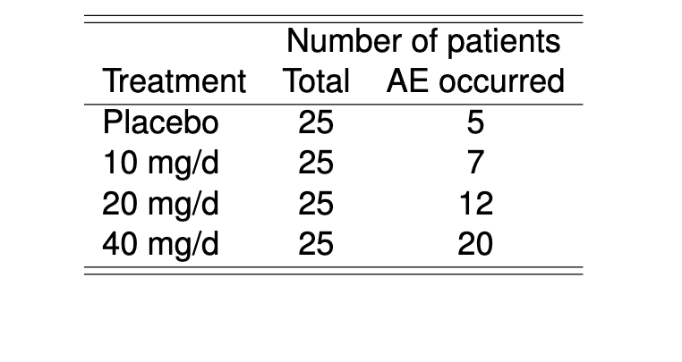

```{r,echo=FALSE,message=FALSE}
knitr::opts_chunk$set(comment='.',fig.align=TRUE,message=FALSE,warning=FALSE)
library(tidyverse)
library(stringr)
library(haven)
library(survival)
library(GGally)
library(binom)
library(texreg)
set.seed(314159)

expit <- function(x) 1 / (1+exp(-x))
``` 

# Causal model: small molecule

```{r,engine='tikz',echo=FALSE}
\begin{tikzpicture}
\node (v0) at (0,0) {exposure};
\node (v1) at (4,0)  {Alive at 1 year};
\node[align=center] (v2) at (0,-2)  {baseline\\disease severity} ;
\node (v3) at (-2,0) {CL};
\node (v4) at (-2,2)  {Weight};
\node (v5) at (0,2) {dose};
\draw [->] (v0) edge (v1);
\draw [->] (v2) edge (v1);
\draw [->] (v4) edge (v3);
\draw [->] (v3) edge (v0);
\draw [->] (v5) edge (v0);
\end{tikzpicture}
```

# Causal model: large molecule

```{r,engine='tikz',echo=FALSE}
\begin{tikzpicture}
\node (v0) at (0,0) {exposure};
\node (v1) at (4,0)  {Alive at 1 year};
\node[align=center] (v2) at (0,-2)  {baseline\\disease severity} ;
\node (v3) at (-2,0) {CL};
\node (v4) at (-2,2)  {Weight};
\node (v5) at (0,2) {dose};
\draw [->] (v0) edge (v1);
\draw [->] (v2) edge (v1);
\draw [->] (v4) edge (v3);
\draw [->] (v2) edge (v3);
\draw [->] (v3) edge (v0);
\draw [->] (v5) edge (v0);
\end{tikzpicture}
```


# Causal model with TGI

```{r,engine='tikz',echo=FALSE}
\begin{tikzpicture}
\node (v0) at (0,0) {exposure};
\node (v1) at (4,0)  {Alive at 1 year};
\node[align=center] (v2) at (0,-2)  {baseline\\disease severity} ;
\node (v3) at (-2,0) {CL};
\node (v4) at (-2,2)  {Weight};
\node (v5) at (0,2) {dose};
\node (v6) at (2,0) {SLD};
\draw [->] (v0) edge (v6);
\draw [->] (v2) edge (v1);
\draw [->] (v4) edge (v3);
\draw [->] (v2) edge (v3);
\draw [->] (v3) edge (v0);
\draw [->] (v5) edge (v0);
\draw [->] (v6) edge (v1);
\end{tikzpicture}
```


# Basic Notation

For now, we will use this high-level notation: 

* $\mu$  model parameter ("intercept")
* $\beta$ model parameter (coefficient for effect of exposure or covariate)
* $C$, $D$, $T$ : exposure (think of a steady-state exposure metric for now, e.g. $\mathrm{CAVG}_\mathrm{ss}$), or dose, or just treatment indicator. 
* $X$ : covariates
* $Y$ : As-yet-unrealized / unobserved response ("DV")
* $y$ : Observed value for $Y$ 

# Probability versus statistics

In some cases we will be thinking  in the "forward" / probability / "Greek to Roman" direction: 

$$
\begin{eqnarray*} 
\mu,\, \beta,\, C,\, X & \stackrel{\mathrm{Probability}}{\longrightarrow} & Y 
\end{eqnarray*}
$$

In other cases we will be thinking in the "reverse" / statistics / "Roman to Greek" direction:

$$
\begin{eqnarray*} 
\mu,\, \beta & \stackrel{\mathrm{Statistics}}{\longleftarrow} &  C,\, X,\, y 
\end{eqnarray*}
$$


# Modeling from a probabilistic point of view

* Those of you who, like myself, were initially trained in a physical or biological science may have started with a deterministic view of modeling.

  * Variability and uncertainty and the statistical tools to
      deal with them were obligatory nuisances to deal with "noise"
      but not the focus of the modeling.
      
  *  This began to turn around for many of us with the increasing
      use of mixed effects modeling in which probability distributions
      are used to describe the "unexplained" portion of
      inter-individual variability.
      
  * Even then I suspect most of us continued to view residual
      variability as more of a nuisance than as an integral component
      of the model.
      
* What we will see today is that such notions of modeling do not
    translate well to modeling of categorical, count or time-to-event
    data. A probabilistic perspective is far more useful.

# Modeling from a probabilistic point of view: The likelihood function

Start with the notion that the value of a potential future
  measurement $Y$ is a random variable

* It is not predictable with certainty (even if we know all of
    the model parameters with certainty)

* The probabilities of different values are described in terms
    of a probability distribution
$$ Y \sim p\left(y \,|\,\theta, x\right) $$
where $\theta$ is a vector of model parameters and $x$ is a vector of
covariates.

* If $Y$ is a continuous random variable then $p\left(y \,|\,\theta,x\right)$ is a probability density function.

* If $Y$ is a discrete random variable then $p\left(y \,|\, \theta,x\right)$ is a probability function.


# Modeling from a probabilistic point of view: The likelihood function

  Suppose that future measurement is a plasma drug concentration at
  some time $t$ following an IV bolus of a drug where the
  pharmacokinetics can be described by a 1 compartment model with
  normally distributed residual variation.
  \begin{eqnarray*}
    Y &\sim& p\left(y \,|\, CL, V, \sigma^2, t, D\right) \\
    p\left(y \,|\, CL, V, \sigma^2, t, D\right) &=& \frac{1}{\sqrt{2\pi}
      \sigma} e^{-\frac{1}{2\sigma^2} \left(y - \widehat{c}\left(t, D, CL,
          V\right)\right)^2} \\
    \widehat{c}\left(t, D, CL,
      V\right) &=& \frac{D}{V} e^{-\frac{CL}{V} t}
  \end{eqnarray*}
  So even if you know the values of $CL$, $V$ and $\sigma^2$ you
  cannot say that $Y$ will be a particular value. However, you can say
  the probability that $Y$ will be within some specified interval.

# Modeling from a probabilistic point of view: The likelihood function

   
* Suppose you already observed a measured value $y_{obs}$.

* That value is no longer a random variable since we know its
    value.

* If we insert that observed value into our probability
    distribution function we now refer to that function as a
    ***likelihood function***.

* It is the same function as before but we now view it as a
    ***function of the parameters given the data*** instead of as a function
    of the data given the parameters.
 
$$ L\left(\theta \,|\,y_{obs}, x\right) = p\left(y_{obs} \,|\,\theta,
  x\right) $$

# Modeling from a probabilistic point of view: The likelihood function

$$ L\left(\theta \,|\,y_{obs}, x\right) = p\left(y_{obs} \,|\, \theta,
  x\right) $$
 
* During model development we generally do not know the values of
  the parameters $\theta$ and use the observed data to estimate those
  parameters.

* The likelihood function contains information about what those
  parameter values might be.

* We will talk about two different approaches that exploit the
  likelihood function to estimate $\theta$:
   
  * Maximum likelihood estimation
  * Bayesian statistical analysis
   
 

# Maximum likelihood for continuous data

* Apply this idea to our one compartment model example.

* Suppose we observed a plasma drug concentration on two occasions.
    
* The resulting likelihood function is:
   
  \begin{eqnarray*}
    L\left(CL, V, \sigma^2 \,|\, y_{obs1}, y_{obs2}, t_1, t_2, D\right)
    &=& \prod_{i=1}^2  L\left(CL, V, \sigma^2 \,|\, y_{obsi},
      t_i, D\right) \\
    &=& \prod_{i=1}^2 \frac{1}{\sqrt{2\pi}
      \sigma} e^{-\frac{1}{2\sigma^2} \left(y_{obsi} - \widehat{c}\left(t_i, D, CL,
          V\right)\right)^2} \\
    \widehat{c}\left(t, D, CL,
      V\right) &=& \frac{D}{V} e^{-\frac{CL}{V} t}
  \end{eqnarray*}


# Maximum likelihood for continuous data
  
   
*  The above equation generalizes to any number of observations.

*  For $n$ observations described by a normal distribution where
    the mean is a function $f\left(x,\theta\right)$ of the parameters
    $\theta$ and covariates $x$:
    \begin{eqnarray*}
      L\left(\theta \,|\, y_{obs}, x\right)
      &=& \prod_{i=1}^n  L\left(\theta \,|\, y_{obsi}, x_i\right) \\
      &=& \prod_{i=1}^n \frac{1}{\sqrt{2\pi}
        \sigma} e^{-\frac{1}{2\sigma^2} \left(y_{obsi} - f\left(x_i, \theta\right)\right)^2} \\
    \end{eqnarray*}

*  The maximum likelihood estimate of $\theta$ is the value of
    $\theta$ that maximizes this likelihood function.
   

# Maximum likelihood for continuous data

   
*  Rather than maximize the likelihood directly, many ML
    algorithms minimize the transformation $-2log\left(L\left(\theta
        \,|\,y_{obs},x\right)\right)$

*  For the above normally-distributed case this becomes:
<font size="5">  
\begin{eqnarray*}
      -2\log\left(L\left(\theta \,|\, y_{obs}, x\right)\right)
      &=& \sum_{i=1}^n  -2\log\left(L\left(\theta \,|\, y_{obsi}, x_i\right)\right) \\
      &=& \sum_{i=1}^n -2\log\left(\frac{1}{\sqrt{2\pi}
          \sigma} e^{-\frac{1}{2\sigma^2} \left(y_{obsi} - f\left(x_i,
              \theta\right)\right)^2}\right) \\
      &=& \sum_{i=1}^n \left(\log\left(2\pi\right) +
        \log\left(\sigma^2\right) + \frac{\left(y_{obsi} - f\left(x_i,
              \theta\right)\right)^2}{\sigma^2}\right) \\
      &=& n\log\left(2\pi\right) +
      n\log\left(\sigma^2\right) + \sum_{i=1}^n \frac{\left(y_{obsi} - f\left(x_i,
            \theta\right)\right)^2}{\sigma^2} 
\end{eqnarray*}
</font>

*  This shows that the least-squares estimates of $\theta$ are
    also the ML estimates for this case.
   

# Extending ML to "odd-type" data
  
Binary data
   
*  Most often binary data is used to represent the occurrence or
    non-occurrence of an event.

*  We often use numerical values such as 1 and 0 to represent
    those two possible outcomes, e.g., 1 for "it happened" and 0 for
    "it didn't happen".

*  Suppose we want to model the occurrence of a particular
    adverse event. Let's start with one patient. The random variable
    $Y$ representing the possible AE occurrence is 1 if the AE occurs
    and 0 if it doesn't. This is just a Bernoulli trial that is
    modeled as:
    \begin{eqnarray*}
      Y \sim p\left(y \,|\,\theta, x\right) &=& \left\{\begin{array}{ll}
          p_{AE}\left(\theta, x\right), & y = 1 \\
          1 - p_{AE}\left(\theta, x\right), & y = 0 
        \end{array}\right. \\
      &=& p_{AE}\left(\theta, x\right)^y \left(1 - p_{AE}\left(\theta,
          x\right)\right)^{1 - y}
    \end{eqnarray*}
    where $p_{AE}\left(\theta, x\right)$ is the probability that the
    AE occurs shown as a function of one or more parameters $\theta$
    and covariates $x$.
   

# ML modeling of binary data
  
Now suppose we observe whether or not the AE occurs in 100 patients in a dose response study with the following results:

<p align="center">
  
</p>


# ML modeling of binary data

Let's try modeling the probability of an AE in the $i^{th}$ patient
  as a function of dose according to a linear logistic model:
$$ \text{logit}\left(p_{AE}\left(\theta, D_I\right)\right) = \theta_0
+ \theta_1 D_i $$ 
The logit transformation is commonly used to
transform between the range of probability (0,1) and the entire real
line:
\begin{eqnarray*}
  \text{logit}\left(p\right) &=& \log\left(\frac{p}{1 - p}\right), \ \ 0 < p
  < 1 \\
  \text{logit}^{-1}\left(x\right) &=& \frac{e^x}{1 + e^x} =
  \frac{1}{e^{-x} + 1}, \ \ -\infty < x < \infty
\end{eqnarray*}
The inverse logit is also sometimes referred to as the expit
  function.

# ML modeling of binary data

  So the likelihood for that patient is:
$$ L\left(\theta \,|\,y_{obsi}, D_i\right) = p\left(y_{obsi} \,|\,\theta,
  D_i\right) = p_{AE}\left(\theta, D_i\right)^{y_{obsi}} \left(1 -
  p_{AE}\left(\theta, D_i\right)\right)^{1 - y_{obsi}} $$ 
The overall
likelihood for the study results is:
\begin{eqnarray*} L\left(\theta \,|\,y_{obs}, D\right) &=&
  \prod_{i=1}^{100} p\left(y_{obsi} \,|\,\theta, D_i\right) \\
  &=& \prod_{i=1}^{100} p_{AE}\left(\theta, D_i\right)^{y_{obsi}}
  \left(1 - p_{AE}\left(\theta, D_i\right)\right)^{1 - y_{obsi}} 
\end{eqnarray*}
where yobs
and D are vectors of the individual patient values. \newline

The value of $\theta$ that maximizes the likelihood value is the ML
estimate.


# Likelihood function for binary data example

<p align="center">
  
</p>


# A brief review of Bayesian inference
### Bayes Rule


$\color{firebrick}{\text{Bayes Rule}}$ the basis for inference about model parameters ($\theta$) given data ($y$) and prior knowledge about model parameters ($p\left(\theta\right)$):
\begin{eqnarray*}
p\left(\theta\,|\,y\right) &=& \frac{p\left(\theta\right)p\left(y\,|\,\theta\right)}{p\left(y\right)}
= \frac{p\left(\theta\right)p\left(y\,|\,\,\theta\right)}{\int{p\left(\theta\right)p\left(y\,|\,\theta\right) d\theta}}
\\ 
&\propto& p\left(\theta\right)p\left(y\,|\,\theta\right)
\end{eqnarray*}
The $p$'s are probabilities or probability densities of the specified random variables.

# Bayesian modeling/inference process

<font size="6">  

1. Assess prior distribution $p\left(\theta\right)$

    * $\theta$ viewed as random variables

    * Subjective
   
    * Ideally base on all available evidence/knowledge (or belief)
   
    * Or deliberately select a non-informative (or weakly informative)
  prior (e.g., reference, vague or improper prior)

2. Construct a model for the data $p\left(y \,|\, \theta\right)$, also known as the likelihood function when viewed as a function of $\theta$.

3.  Calculate posterior distribution $p\left(\theta \,|\, y\right)$.
   
    * Use for inferences regarding parameter values

4. Calculate posterior predictive distribution $p\left(y_\text{new} \,|\, y\right)$.
   
    * Use for inferences regarding future observations

$$p\left(y_{new}\,|\,y\right) = \int{p\left(y_{new}\,|\,\theta\right)p\left(\theta\,|\,y\right) d\theta}$$
</font>


# Bayesian modeling of odd-type data
  
*  Return to the linear logistic regression example where we observe whether or not an AE
    occurs in each of 100 patients and the probability of an AE is
    given by

$$ \text{logit}\left(p_{AE}\left(\theta, D_I\right)\right) = \theta_1 + \theta_2 D_i $$ 

*  The likelihood function is the same as before.

*  Now we must also specify a prior distribution for the model
    parameters $\theta$. The resulting expression for the posterior
    distribution of $\theta$ is:

  \begin{eqnarray*}
    p\left(\theta \,|\, y_{obs}, D\right) &\propto& p\left(y_{obs} \,|\, \theta,
      D\right) p\left(\theta\right) = L\left(\theta \,|\, y_{obs}, D\right)
    p\left(\theta\right) \\
    &\propto&
    \prod_{i=1}^{100} p\left(y_{obsi} \,|\, \theta, D_i\right)
    p\left(\theta\right) \\
    &\propto& \prod_{i=1}^{100} p_{AE}\left(\theta, D_i\right)^{y_{obsi}}
    \left(1 - p_{AE}\left(\theta, D_i\right)\right)^{1 - y_{obsi}} p\left(\theta\right)
  \end{eqnarray*}

# Bayesian modeling of odd-type data
  
Now suppose we have a little prior information about the value of $\theta$
and choose to represent that knowledge as a bivariate normal
distribution with relatively large variances and no correlation, i.e., 
$$ \theta \propto N\left(\mu, \Sigma\right) $$
where 
$$ \mu = \left(-1, 0.2\right) \ \ \ \ \Sigma = \left[\begin{array}{cc}
1^2 & 0 \\
0 & 0.2^2
\end{array}\right] $$

# Joint prior and posterior distributions
  
\vspace{-9pt}
\begin{center}
\includegraphics[height=0.95\textheight]{graphics/binaryExampleJointPosterior.pdf}
\end{center}

<p align="center">
  
</p>

# Marginal prior and posterior distributions
  
\vspace{-9pt}
\begin{center}
\includegraphics[height=0.95\textheight]{graphics/binaryExampleMarginalPosterior.pdf}
\end{center}

<p align="center">
  
</p>

# Modeling binary data: Logistic regression

  Logistic regression refers to the fitting of binary data with models
  of the form:
$$ \text{logit}\left(p\right) = f\left(x, \theta\right) $$
where $p$ is the probability that some event (e.g., an AE) occurs and
$x$ is a vector of covariates.


# Stats notation for the Bernoulli distribution


$$
Y_i \sim \mathrm{Ber}(p) \,\,\, \mathrm{independently} \text{ for} \,\, i = 1, \ldots, n
$$
Or equivalently, we could specify the probability mass function:

$$
\begin{eqnarray*}
P(Y_i=y_i \, | \, p) = p^{y_i}(1-p)^{(1-y_i)} \,\, \text{for} \,\, i = 1, \ldots, n  \\ (\text{where each} \,\, y_i = 0 \,\, \text{or} \,\, 1).
\end{eqnarray*}
$$

# Workbook 

* rbinom
* dbinom

# The Likelihood function

__Likelihood__ for a single Bernoulli observation

$$
l(p \, | \, Y_i = y_i) = P(Y_i=y_i) = p^{y_i}(1-p)^{(1-y_i)} 
$$

__Joint likelihood__ for a sample for independent Bernoulli observations

$$
\begin{eqnarray*}
l(p \,|\, \mathbf{Y}=\mathbf{y}) & = & \prod_{i=1}^{n} P(Y_i=y_i)  =   \prod_{i=1}^{n}p^{y_i}(1-p)^{(1-y_i)} \\
& = & p^{(\# \, \text{of "ones"})}(1-p)^{n - (\# \, \text{of "ones"})}
\end{eqnarray*}
$$

# Log likelihood

Joint __log__ likelihood:

$$
\begin{eqnarray*}
L(p \,|\, \mathbf{Y}=\mathbf{y}) & = & (\# \, \text{of successes}) \log(p)  \\ 
& + & (n-\# \, \text{of successes}) \log(1-p) 
\end{eqnarray*}
$$

Derivative of joint log likelihood: 

$$
\frac{\mathrm{d}L}{\mathrm{d}p} = 0 \iff  p = \frac{(\# \, \text{of successes})}{n}
$$

* When we have a full GLM with covariates, there is no analytical solution to the likelihood equations. 
* However there is a numerical root finder that is specially tailored to the structure of GLM models: the `Newton-Raphson` method ([see @2795]). 

# Likelihood maximization

* As in the workbook exercises, an generic numerical optimization algorithm (e.g. `optim()`) *can* be used to maximize the likelihood for a full GLM.  
* In fact, in (rare) special cases, it makes sense to do exactly that. (E.g. if there are constraints on some parameters: [see @3625], p. 269]). 
* Again, more typically, Newton-Raphson is used. 

# Workbook 

* likelihood computation 
* likelihood maximization

# Odds of an event

* `Conditional probability` of an event, conditional on treatment "1".

$$ P(Y=1 \, | \, T = 1) $$
* `Odds` of an event, conditional on treatment "1": 

$$ \frac{P(Y=1 \, | \, T = 1)}{P(Y=0 \, | \, T = 1)} = \frac{P(Y=1 \, | \, T = 1)}{1 - P(Y=1 \, | \, T = 1)}$$

* `Odds ratio` of an event, for treatment "1" versus treatment "0":

$$ \frac{\left.P(Y=1 \, | \, T = 1)\, \right/ P(Y=0 \, | \, T = 1)}{\left.P(Y=1 \, | \, T = 0) \, \right/ P(Y=0 \, | \, T = 0) }$$


# Other measures of efficacy for binary data

Relative risk of an event, for treatment "1" versus treatment "0":

$$ \frac{P(Y=1 \, | \, T = 1)}{P(Y=1 \, | \, T = 0)}$$
Anecdotally, this is often the preferred / most interpretable way to quantify efficacy.

NB: Odds ratio and relative risk are sometimes confused with each other. Note the difference. 


# Other measures of efficacy for binary data
    
Difference in probability of events, for treatment "1" versus treatment "0":
    

$$ P(Y=1 \, | \, T = 1) - P(Y=1 \, | \, T = 0) $$
Often undesirable: do you want to treat the difference between 3% and 5% the same way that you treat the difference between 23% and 25% ? 

# Workbook

* odds ratios

# The logit transform

* The logit, or "log odds" function

$$\mathrm{logit}(p)=\log\left(\frac{p}{1-p}\right)$$

* The standard logistic function (also called the "expit") is the inverse of the logit:

$$p = \mathrm{expit}(x)=1/(1+\exp(-x))$$ 

# Workbook

* logistic function

# Other "link functions"

* logit function takes us from the unit interval to the full Real line: 

$$ (0, 1) \stackrel{\mathrm{expit}}{\longrightarrow} \mathbb{R} $$

* Another alternative "link" function is the `probit` : 

$$ \mathrm{probit}(p) = \Phi^{-1}(p)$$ 
Where $\Phi$ is the Normal Cumulative Density Function (CDF): 

$$ \Phi(x) = P(\mbox{Std. Normal Variate} < x)  $$

# A logit-link GLM

A GLM with a logit link and Bernoulli (or more generally, Binomial) residuals is referred to as a *logistic regression*. 

A logistic regression with exposure ($C_i$) as the sole predictor would be expressed as: 

$$ Y_i \sim \mathrm{Ber}(p_i) \,\,\, \text{where} \,\,\, p_i = \mathrm{expit}(\mu + \beta C_i) \,\, ; \,\,i = 1,\ldots, n$$

Or equivalently:

$$ Y_i \sim \mathrm{Ber}(p_i) \,\,\, \text{where} \,\,\, \mathrm{logit}(p_i) = \mu + \beta C_i \,\, ; \,\,i = 1,\ldots, n$$


# What exactly is a GLM?

* The `generalized` in `generalized linear model` refers to the non-Normal residuals (in this case, Bernoulli residuals). 
* NB: `generalized` $\neq$ `general`. A `general linear model` has Normally distributed residuals; `general` in that context refers to possible correlation amongst the residuals.   
* The `linear` in `generalized linear model` refers to the fact that the right hand side of, e.g. 
    
$$ \mathrm{logit}(p_i) = \mu + \beta C_i $$
is linear __in the parameters__ (i.e. it is a linear function of $\mu$ and $\beta$).


# Quiz 

Which (if any) of the following is linear in the parameters?

$$\mu + \beta \log(C)  \,\,\,\,\,\,\,\,\,\,\, \mu + \frac{\beta}{C} \,\,\,\,\,\,\,\,\,\,\, \mu + \frac{\beta_1 C}{(\beta_2 + C)}$$


# Anatomy of a GLM

Taking the following model as an example: 

$$ Y_i \sim \mathrm{Ber}(p_i) \,\,\, \text{where} \,\,\, \mathrm{logit}(p_i) = \mu + \beta C^*_i \,\, ; \,\,i = 1,\ldots, n$$

Standard terminology to refer to the model components is:

* $Y_i \sim \mathrm{Ber}(p_i)$ is the `residual` component of the model. (Sometimes also called the `random` component of the model, but we avoid that terminology is it becomes ambiguous in a `GLMM` context that includes random effects).
* The logit transformation is the `link` function. 
* $\mu + \beta C^*_i$ is the `linear predictor`.


# Other examples of GLMs

|Common Name            | Link function   | Residual component      | Application
|:----------------------|:----------------|:------------------------|:---------------
|Logistic regression    | logit           | Binomial (or Bernoulli) | Binary response
|Probit regression      | probit          | Binomial (or Bernoulli) | Binary response
|Poisson regression     | log             | Poisson                 | Count data
|Cumulative link models | logit or probit | Multinomial             | Ordered categorical
|Beta regression        | logit or probit | Beta                    | Bounded response
|ANCOVA                 | identity        | Normal                  | Continuous response


See @2795 for more examples and general discussion of GLMs. 

# GLMs and Time-to-event models

* Many parametric time-to-event models (e.g. many accelerated failure time models) also *can* be expressed as GLMs with a log or identity link, but they usually require different techniques to optimize the likelihood in order to accomodate censored time-to-event data, and so aren't typically presented in a GLM context. However, here is an ...
* __Advanced Pro-tip__ (not covered here) : Functions not explicitly designed to fit GLMs can  sometimes be used for that purpose. E.g. `flexsurv::flexsurvreg` could be used to fit a GLM with a log link and Gamma residuals. (Your data doesn't *have* to be censored or consist of times-to-event in order to use those functions).

# Workbook

* simulating a GLM


# References
