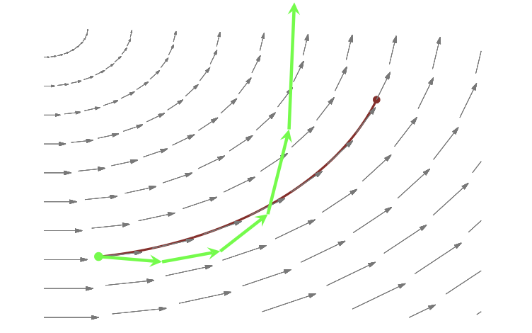
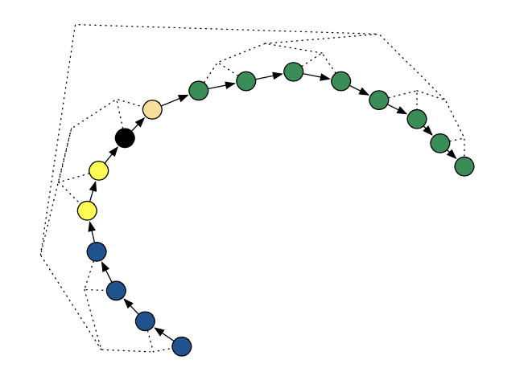
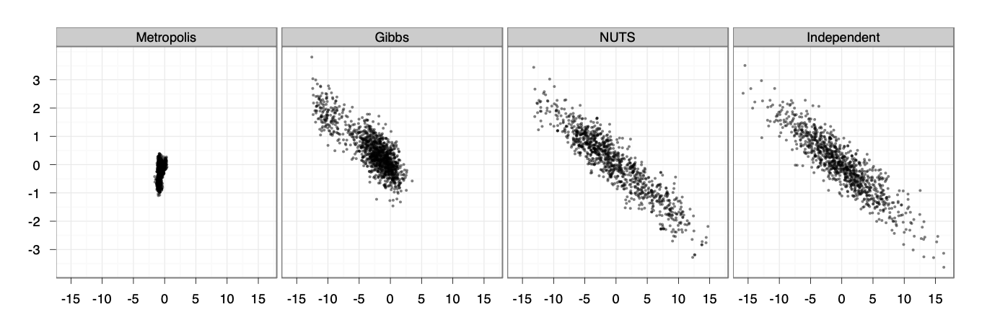

```{r,echo=FALSE,message=FALSE}
knitr::opts_chunk$set(comment='.',fig.align=TRUE,message=FALSE,warning=FALSE, echo=FALSE)

library(tidyverse)
library(stringr)
library(haven)
library(survival)
library(survminer)
library(survMisc)
library(texreg)
library(tidybayes)
library(bayesplot)
library(muhaz)
library(rstan)

set.seed(314159)
theme_set(theme_bw())
bayesplot::color_scheme_set("viridis")
``` 


```{r}
# OS data
d <- read_csv('../data/source/DDmodel0218_Simulated_OS.csv', na = c('.','-99'))

# Add week 12 (Day 84) predicted tumor size
d84 <- d %>% 
  filter(TIME <= 84) %>% 
  group_by(ID) %>% 
  mutate(rate = KG/1000 - KD0/1000*AUC0 - KD1/100*AUC1,
         prevTIME = lag(TIME,default = 0),
         change = exp(rate * (TIME-prevTIME)),
         ipred = IBASE * 1000 * cumprod(change)
         ) %>% 
  arrange(ID,TIME) %>% 
  slice(n()) %>% 
  mutate(ipred84 = ipred * exp(rate * (84-TIME)),
         rts84 = ipred84 / ( IBASE * 1000 ) )

dos <- d %>% 
  filter(TIME>0) %>% 
  group_by(ID) %>% 
  mutate(meanGem = mean(AUC1),
         Group = if_else(meanGem > 0, "Cb+G", "Cb")) %>% 
  ungroup() %>% 
  filter(CMT==2, EVID==0) %>% 
  left_join(d84 %>% select(ID, ipred84, rts84)) %>% 
  mutate(rts84_f = paste0("Q", ntile(rts84, n = 4)))

dos84 <- dos %>% 
  filter(TIME>84) %>% 
  mutate(TIME = TIME-84)


```

# Key learning objectives for today

* Brief tour of Hamiltonian Monte Carlo

* Coding simple models in Stan
    - Logistic regression models
    - TTE models with closed-form solutions
* Adding complexity
    - Non-linear effects
    - Numerically integrating the hazard function

* Coming next week
  - Variables which vary continuously with time
  - Repeated time-to-event models


# Stan is a probabilistic programming language

* There is an extensive ecosystem built around Stan (R, python, etc )

* Can perform 
    * Full MCMC sampling using Hamiltonian Monte Carlo sampling
    * Approximate Bayesian inference
    * Penalized maximum likelihood

* We'll focus exclusively on MCMC

# Stan documentation

Stan documentation is extensive:

  * [Stan webpage](https://mc-stan.org/)
  * [Stan reference manual](https://mc-stan.org/docs/2_21/reference-manual/)
      - manual for the Stan programming language, inference algorithms, and posterior analysis tools 
  * [Stan user's guide](https://mc-stan.org/docs/2_21/stan-users-guide/index.html)
      - Example models
      - Programming techniques
  * [Stan function reference](https://mc-stan.org/docs/2_21/functions-reference/index.html)
      - lists all of the built-in functions and their signatures
      - **probability distributions**


# Hamiltonian Monte Carlo concepts (1)

See Stan Reference Manual (chapter 15) and Betancourt (@Betancourt2017-tb) for a more thorough explanation.

:::{.notebox}

* Gibbs sampling and Metropolis-Hastings samplers use a random walk approach to sampling the posterior
  - Leads to inefficient sampling in high dimensional space (or poor geometry)
  
* We can sample more efficiently by using information about the shape of the posterior distribution

* Use principles from Hamiltonian dynamics to sample from the posterior

:::


# Hamiltonian Monte Carlo concepts (2)

:::{.columns}

::::{.column}

* Particle moves through the parameter space according to its potential energy (-log-posterior) and kinetic energy (momentum).

* The HMC algorithm starts at a specified initial set of parameters $\theta_0$.

* For a given number of iterations, a new momentum vector is sampled and the current value of the parameter $\theta$ is updated  according to Hamiltonian dynamics

    - Using the leapfrog integrator with step size $\epsilon$ and number of steps $L$
    - How far it moves depends on the momentum and geometry of the posterior surface

* A Metropolis acceptance step is applied

::::

::::{.column}
```{r, fig.cap="Figure 29 from Betancourt 2017.", out.width='95%'}

```
::::

:::


# HMC tuning

The HMC algorithm has three parameters, and the sampling efficiency is sensitive to their choice:

* step size, $\epsilon$
    - automatically optimized during warm-up to match an acceptance-rate target
* metric, $M$, an approximation of the covariance (curvature) of the posterior
    - automatically estimated during warm-up sample iterations
* number of steps taken, $L$
    - adaptively tuned using the No U-Turn Sampler (NUTS)   
    
Stan automatically optimizes $\epsilon$ and $M$, but (if really necessary) other setting can influence the automatic selection of them.


# Divergent transitions

A [divergence](https://mc-stan.org/docs/2_21/reference-manual/divergent-transitions.html) arises when the simulated Hamiltonian trajectory departs from the true trajectory as measured by departure of the Hamiltonian value from its initial value. 

* If the posterior is highly curved, very small step sizes are required for this gradient-based simulation of the Hamiltonian to be accurate. 
* When the step size is too large (relative to the curvature), the simulation diverges from the true Hamiltonian.
* When this divergence is too high, the simulation has gone off the rails and cannot be trusted. 


```{r, fig.cap="Portion of Figure 1 from Hoffman and Gelman, 2014. @Hoffman2014-xe", out.height='45%'}

```

# Efficiency of HMC vs Metropolis-Hastings

```{r, fig.cap="Figure 7 from Hoffman and Gelman, 2014. @Hoffman2014-xe", out.width='95%'}

```

Samples generated by random-walk Metropolis, Gibbs sampling, and NUTS. The plots compare 1,000 independent draws from a highly correlated 250-dimensional distribution (right) with 1,000,000 samples (thinned to 1,000 samples for display) generated by random-walk Metropolis (left), 1,000,000 samples (thinned to 1,000 samples for display) generated by Gibbs sampling (second from left), and 1,000 samples generated by NUTS (second from right). Only the first two dimensions are shown here.


# Stan programs

A Stan program is organized into <red>a sequence of named blocks</red>. 

In each block:

* variable declarations
* followed by programming statements

All block types are optional but they must enter the model in a specific order.

Every variable used in a Stan program must have a declared data type (like c++)

Variables declared in each block have scope over all subsequent statements (including statements in other blocks)

* One exception: variables declared in model block are local to the model block

# Code blocks

::::{.columns}

:::{.column}

The following are valid code blocks and must appear in this order:

* functions
* <red>data</red>
* transformed data
* <red>parameters </red>
* transformed parameters
* <red> model </red>
* generated quantities

:::

:::{.column}

```
<block type>{
... declarations ...
... statements ...
}
```

:::
::::

# Data block

:::{.columns}

::::{.column}

* Declaration of variables that are read in as data
* Allows only declarations, no programming statements

```
data {
  int<lower=1> N;  // total number of observations
  int<lower=0, upper=1> Y[N];  // binary response variable
  vector[N] x;  // predictor
  int prior_only;  // should the likelihood be ignored?
}
```

::::

::::{.column}

Variable types:

* `int` for integer values
* `real` for continuous values
* `vector` for column vectors (real)
* `row_vector` for row vectors (real)
* `matrix` for matrices (real)

Any type can be made into an array type by declaring array arguments. For example,
```
real x[10];
matrix[3, 3] m[6, 7];
```

* `x` is a one-dimensional array of size $10$ containing real values
* `m` is a two-dimensional array of size  $6 \times 7$ containing values that are $3 \times 3$ matrices

NB: Array declaration is clearer in Version 2.26.

::::
:::

# Transformed data block

* For declaring and defining variables that that are functions of the data and that do not need to be changed
* Variables are defined in programming statements statements

```
transformed data {
  int Kc = K - 1;
  matrix[N, Kc] Xc;  // centered version of X without an intercept
  vector[Kc] means_X;  // column means of X before centering
  for (i in 2:K) {
    means_X[i - 1] = mean(X[, i]);
    Xc[, i - 1] = X[, i] - means_X[i - 1];
  }
}
```

# Parameters block

* The variables defined in this block are the parameters being sampled by Stan
* HMC and NUTS are implemented over a multivariate probability density that has support on all of $\mathbb{R}^n$

* Hamiltonian Monte Carlo requires the gradient of the (unnormalized) log probability function with respect to the unconstrained parameters 
    * the unconstrained version of the parameters is what’s sampled or optimized.

```
parameters {
  real alpha;  // intercept
  real beta ;  // slope
}
```


# Transformed parameters block

* Similar to the `transformed parameters` block but for parameters
* Variables defined in terms of data and parameters 


# Model block

* Where the log probability function is defined. 
* All variables defined here are local to the model block
    * May not be defined with constraints 

```
model {
  // log-likelihood contributions
  if (prior_only==0) {
    Y ~ bernoulli_logit(alpha + beta*x);
  }
  // prior didstributions
  beta ~ normal(0,3);
  alpha ~ normal(0,3);
}
```

# Generated quantities block

* Derived quantities based on parameters, data, and (optionally) random number generation
* Applications of posterior inference that can be coded in the generated quantities block include:
    * forward sampling to generate simulated data for model testing,
    * generating predictions for new data,
    * calculating posterior event probabilities
    * calculating posterior expectations
    * calculating log likelihoods, deviances, etc. for model comparison.

```
generated quantities {

  vector[N] Ysim;  // response variable
  vector[N] log_like; // log-likelihood, for calculating LOO
  
  for (n in 1:N) {
    Ysim[n] = bernoulli_logit_rng(alpha + beta*x[n]);
    log_like[n] = bernoulli_logit_lpmf(Y[n] | alpha + beta*x[n]);
  }
  
}
```


# Functions block

* A block to declare user-defined functions
* Function definitions and declarations may appear in any order, subject to the condition that a function must be declared before it is used. 

For example,

```
real cv(real mu, real sigma) { return(mu/sigma); }
```

A function that returns a `real` with two arguments of types `real` and `real` named `mu` and `sigma`.


# Example logistic regression model

* As an example, let's model the probability of ECOG status=1 as a function of observed baseline tumor size

$$
\text{logit}\left(P(\text{ECOG}=1 ~|~ x)\right) = \alpha + \beta  x
$$

* Stan code for this model is in `../model/stan/logistic_regression_example.stan`

# Running the model using rstan

:::{.columns}

::::{.column}

* Define data as a list
* Provide initial values for Markov chains (optional)
* Call Stan

::::

::::{.column}

```{r, echo=TRUE, warning=FALSE, message=FALSE, results='hide'}
stan_data <- list(N = nrow(dos),
                  Y = dos$ECOG,
                  x = dos$SLD0/10,
                  prior_only = 0)

stan_inits <- function() {
  list(
    alpha = rnorm(1, mean=0, sd=2),
    beta = rnorm(1, mean=0, sd = 1)
  )
}

fit_lr <- stan(file = '../model/stan/logistic_regression_example.stan',
               data = stan_data,
               chains = 4,iter = 2000, warmup = 1000, 
               init = stan_inits, 
               cores = 2)
```

::::

:::

# Stan output

:::{.columns}

::::{.column width='60%'}

```{r, echo=TRUE}
print(fit_lr, pars = c('alpha','beta'))
```

::::

::::{.column width='40%'}

```{r, echo=TRUE, out.width='95%'}
plot(fit_lr, pars=c('alpha','beta'))
```

::::

:::

# Diagnostic plots

:::{.columns}

::::{.column width='45%'}

```{r, echo=TRUE}
samples <- spread_draws(fit_lr, alpha,beta) %>% rename(Chain = .chain)
mcmc_trace(samples, pars = c('alpha','beta'))
```

::::

::::{.column width="45%"}

```{r, echo=TRUE}
mcmc_scatter(samples, pars=c('alpha','beta'))
```

::::

:::


# Workbook Stan01

Expanding the logistic regression model to include a power term

$$
\text{logit}\left(P(\text{ECOG}=1 | x)\right) = \alpha + \beta  x^\gamma
$$

# Time to event model with a simple hazard model

Let's re-fit the overall survival model, using a Weibull baseline hazard and a proportional effect of covariates.  

* Note this is a different parameterization than used in `brms`

$$
\begin{align*}
h_i(t) &= h_0(t) \times \exp(\beta \times \text{RTS}_i)  \\
h_0(t) &= \lambda_0 \times \alpha \ \times t^{\alpha-1}\\
\\
H_i(t) &= \lambda_i t^\alpha \\
S_i(t) &= \exp(-\lambda_i t^\alpha)
\end{align*}
$$

Under the standard assumption that censoring times are independent of event times, the individual contributions to the log-likelihood function are

$$
\ell_i(\theta) = \begin{cases}
\log h_i(T^*_i) - H_i(T^*_i) & \text{for } \delta_i = 1 \\
-H(T^*_i) & \text{for } \delta_i = 0
\end{cases}
$$

# Model fitting

The code is in `../model/stan/weibull_example_v2.stan`.

The Rmarkdown file for running the example is in `weibull_example.Rmd`


# Integrating the hazard function

Stan has some built-in functions to do integration.

We'll start with the simple one-dimensional case before moving to systems of ODEs.

# Function block to define the integrand

For comparison, we'll have Stan integrate the Weibull hazard

  * Not something we'd do in practice
  * Simply for comparison sake :)
  
Integrand functions need this signature, even if you don't use all of the arguments.
```
functions {
  
  real weibull_hazard(real x,        // Function argument
                    real xc,         // Complement of function argument
                                     //  on the domain (defined later)
                    real[] theta,    // parameters
                    real[] x_r,      // data (real)
                    int[] x_i) {     // data (integers)
                      
                      real llambda = theta[1];
                      real lshape = theta[2];
                      
                      return( lshape * llambda * pow(x, lshape-1) );
                      
                    }
}
```

# Use of integrate_1d function

Definite and indefinite one dimensional integrals can be performed in Stan using the [`integrate_1d`](https://mc-stan.org/docs/2_19/functions-reference/functions-1d-integrator.html) function.

```
for (n in 1:N) {

  // Evaluate hazard function - pass arguments to function
  hazard[n] = weibull_hazard(Y[n], 0.0, {mu[n],shape}, {0.0}, {0}  );

  // Integrate hazard function using integrate_1d
  // arguments: function, lower limit, upper limit, theta, x_r, x_i, relative tolerance
  cumulative_hazard[n] = integrate_1d(weibull_hazard, 1E-06, Y[n], {mu[n],shape}, {0.0}, {0}, 1E-08 ) ;

}
```

# Let's use this to fit a model and compare results

An example using the Weibull hazard is in `../model/stan/weibull_example_integrated_hazard.stan`

The Rmarkdown file for running the example is in `weibull_integrated_hazard_example.Rmd`


# Re-cap

* Brief tour of Hamiltonian Monte Carlo

* Coding simple models in Stan
    - Logistic regression models
    - TTE models with closed-form solutions
* Adding complexity
    - Non-linear effects
    - Numerically integrating the hazard function

* Coming next week
  - Variables which vary continuously with time
  - Repeated time-to-event models


# References