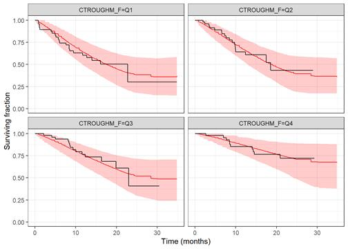
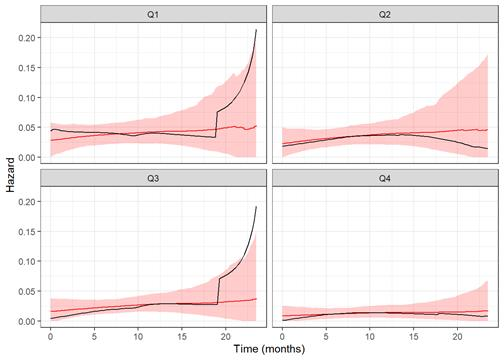

```{r,echo=FALSE,message=FALSE}
knitr::opts_chunk$set(comment='.',fig.align=TRUE,message=FALSE,warning=FALSE, echo=FALSE)

library(tidyverse)
library(survival)
library(survminer)
library(survMisc)

set.seed(314159)
theme_set(theme_bw())
bayesplot::color_scheme_set("viridis")
``` 

# Question 1

```
In case that we are modeling time to first event data and using poisson to approximate the piecewise exponential survival model. I image that under the simulation situation, event could be predicted to occur at different intervals in the same subject. Should we just consider the first event as the predicted event? thanks!
```
I suppose it depends on how you're running your simulation.

I would probably do something like the following slides. 

# Approximating the Cox model

Here's an example based on `vignette(package='survival',topic = 'approximate')`

```{r, echo=TRUE}

kdata = kidney %>% arrange(id,time) %>% filter(!duplicated(id))

# Cox model fit
kfit1 <- coxph(Surv(time, status) ~ age + sex, kdata, ties='breslow')

# Get unique event times
utime <- sort(unique(kdata$time[kdata$status==1])) # unique deaths

# Create interval variable
kdata3 <- survSplit(Surv(time, status) ~., data=kdata, cut=utime,
                    episode="interval")
kdata3 <- subset(kdata3, time == c(utime,0)[interval]) # remove partials

# Approximation using glm
kfit3 <- glm(status ~ age + sex + factor(interval) -1,
             family=poisson, data=kdata3)
```

# Output from the glm fit

These are the log hazard ratios and log hazards.

```{r, echo=TRUE}
coef(kfit3)
```

```{r, echo=TRUE}
coef(kfit1)
```

# Simulating from the model

1. Extract the values
2. Construct the baseline cumulative hazard function
3. For a covariate vector, calculate $hr = \exp(x\beta)$
3. To simulate event times
   a. Simulate $u \sim U(0,1)$
   b. Evaluate $T = H^{-1}(-\log u / hr)$ using linear interpolation

# Question 2

```
I tried out one example using code in BayesianTTE_brms.Rmd.  Instead of tumor size change as predictor, I used trough concentration post cycle 1.

The following figures are

1) KM plot stratified by quartiles of trough concentration post cycle 1.

2) VPC using KM stratified by quartiles of trough concentration post cycle 1.

3) VPC using Hazard stratified by quartiles of trough concentration post cycle 1.

I noticed that VPC using Hazard showed poor fitting for Q1 and Q3 populations.   Since the number of subjects in each quartile is small (n=48), the number of patient at risk is less than 10 (n=17 in Q4) by 20 months.  So my interpretation is that the estimated hazard at late time points, say 20 months and beyond is not reliable.   I wonder if you have additional comments? Thanks!
```

You're correct.  You can see the uncertainty in the wide prediction intervals.

# KM VPCs

```{r, out.width='70%'}

```

# Hazard VPCs

```{r, out.width='70%'}

```

